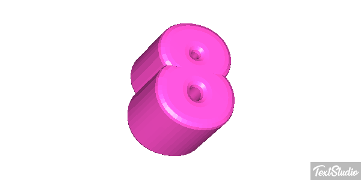

<html lang="pl">
<head>
    <meta charset="UTF-8">
    <meta name="viewport" content="width=device-width, initial-scale=1.0">
    <title>Dokument HTML</title>
</head>
<body>
    
Kacper
 
    
Kacper
 
    
Kacper
 
    
Kacper
 
    
Kacper
 
    
Kacper
 
    
Kacper
 
    <h1>Wawrzyniak-pekar</h1> 
    <h2>Wawrzyniak-pekar</h2> 
    <h3>Wawrzyniak-pekar</h3> 
    <h4>Wawrzyniak-pekar</h4> 
    <h5>Wawrzyniak-pekar</h5> 
    <h6>Wawrzyniak-pekar</h6> 
    
:/ - Zdenerwowanie
 
    
:C - smutek
 
    
:) - szczęście przeciwsłonecznych
 
    
:| - obojętnąś
 
    
:( - mały smutek twarz
 
    
:o - zdziwienie 
 
</body>
</html>

<head>
    <meta charset="UTF-8">
    <meta name="viewport" content="width=device-width, initial-scale=1.0">
    <title>Dane ucznia</title>
</head>
<body>
    
<b>Adres: 80-188</b> <i>Gdańsk</i>, <u>Jana z Kolana</u> <strike>101/34</strike>

    

        
Imię i nazwisko: Jan Kowalski

        
Ulubiony aktor: Tomasz Karolak

        
<i>Data urodzenia: 15 marca 2000</i>

    

    

        
<b>H2SO4</b>

        
<b>x2 = x2</b>

    

</body>
<html lang="pl">
<head>
    <meta charset="UTF-8">
    <meta name="author" content="Jan Kowalski">
    <meta name="description" content="Strona z dowcipami ucznia">
    <title>Strona z dowcipami - Zadanie 3</title>
    
</head>
<body>

<h1 align="right">Dowcipy o babie</h1>

    <fieldset>
        <legend>Baba w sklepie</legend>
        Baba wchodzi do sklepu i pyta: 
        - Czy jest chleb? 
        Sprzedawca odpowiada: 
        - Jest, ale tylko suchy. 
        Baba na to: 
        - A co, mokrego nie ma? 
    </fieldset>

    

    <h2 align="center">Dowcipy o Jasiu</h2>
    <fieldset>
        <legend>Jasiu i szkoła</legend>
        Nauczycielka pyta Jasia: 
        - Jasiu, co chciałbyś robić, jak dorośniesz? 
        Jasiu odpowiada: 
        - Chciałbym być miliarderem jak mój tata! 
        Nauczycielka pyta: 
        - Twój tata jest miliarderem? 
        Jasiu na to: 
        - Nie, ale też chciałby! 
    </fieldset>

<h3 align="left">Dowcipy o informatykach</h3>
<fieldset>
    <legend>Programista i żarówka</legend>
    Ilu programistów potrzeba, żeby wymienić żarówkę? 
    Żadnego, to problem sprzętowy! 
</fieldset>

    Wawrzyniak-Pekar&nbsp;&nbsp;&nbsp;&nbsp;&nbsp;&nbsp;&nbsp;&nbsp;&nbsp;&nbsp;Kacper

    &copy; &reg; &trade; &euro; &yen; &pound; &sect;

</body>

<html lang="pl">
<head>
    <meta charset="UTF-8">
    <meta name="viewport" content="width=device-width, initial-scale=1.0">
    <title>Wyliczenia i Numerowania Informatyczne</title>
    
</head>
<body>

    <h1>Poniżej są trzy wyliczenia z różnymi znakami wyliczenia</h1>
    <h1>Ty zaproponuj swoje, związane z informatyką</h1>
    <ul class="square">
        <li>Kwadrat – Bit</li>
        <li>Kwadrat – Bajt</li>
        <li>Kwadrat – Piksel</li>
    </ul>

    <ul class="circle">
        <li>Koło – Procesor</li>
        <li>Koło – Pamięć RAM</li>
        <li>Koło – Dysk SSD</li>
    </ul>

    <ul class="disc">
        <li>Okrąg – Ethernet</li>
        <li>Okrąg – Wi-Fi</li>
        <li>Okrąg – Bluetooth</li>
    </ul>

       

    <h2>Poniżej są trzy numerowania z różnymi znakami numerowania</h2>
    <h2>Ty zaproponuj swoje, związane z informatyką</h2>
    <ol class="lower-alpha">
        <li>Zmienne</li>
        <li>Stałe</li>
        <li>Funkcje</li>
    </ol>

    <ol class="upper-alpha">
        <li>Algorytmy</li>
        <li>Struktury danych</li>
        <li>Bazy danych</li>
    </ol>

    <ol class="lower-roman">
        <li>System operacyjny</li>
        <li>Sterowniki</li>
        <li>Aplikacje</li>
    </ol>

       

    <h3>Poniżej będą trzy poziomy numerowania/wyliczenia z różnymi rodzajami numerowania/wyliczenia</h3>
    <h3>Ty zaproponuj swoje, związane z informatyką</h3>
    <ol>
        <li>Sprzęt komputerowy
            <ol>
                <li>Jednostka centralna
                    <ol>
                        <li>Procesor</li>
                        <li>Pamięć RAM</li>
                        <li>Płyta główna</li>
                    </ol>
                </li>
                <li>Peryferia
                    <ol>
                        <li>Monitor</li>
                        <li>Klawiatura</li>
                        <li>Mysz</li>
                    </ol>
                </li>
            </ol>
        </li>
        <li>Oprogramowanie
            <ol>
                <li>System operacyjny
                    <ol>
                        <li>Windows</li>
                        <li>Linux</li>
                        <li>macOS</li>
                    </ol>
                </li>
                <li>Aplikacje
                    <ol>
                        <li>Pakiet biurowy</li>
                        <li>Przeglądarka internetowa</li>
                        <li>Program graficzny</li>
                    </ol>
                </li>
            </ol>
        </li>
    </ol>

</body>

<html lang="pl">
<head>
    <meta charset="UTF-8">
    <meta name="viewport" content="width=device-width, initial-scale=1.0">
    <title>Dowcipy z grafikami</title>
</head>
<body>
    <h1>Śmieszne dowcipy z grafikami</h1>

    
Dowcip 1: Jakie są ulubione kwiaty hydraulika? ... Kwiaty wodociągowe!

    

    
Dowcip 2: Jak śni programista? ... Na JAVIE!

    

    
Dowcip 3: Dlaczego komputer nie może się przeziębić? ... Bo ma antywirus!

    

    
Dowcip 4: Co mówi zero do ósemki? ... Ładny pasek!

    

    
Dowcip 5: Dlaczego Java nosi okulary? ... Bo nie widzi rozdzielczości!

    

</body>

<!DOCTYPE html>
<html lang="pl">
<head>
    <meta charset="UTF-8">
    <meta name="viewport" content="width=device-width, initial-scale=1.0">
    <title>Strona główna</title>
</head>
<body>
    <h1>Strona główna</h1>
    <nav>
        <a href="poczta_Wawrzyniak-Pekar.html">Link do poczty</a> 
        <a href="plik1.zip">Link do ściągania pliku</a> 
        <a href="#start">Link początek tekstu</a> 
        <a href="#srodek">Link do środka tekstu</a> 
        <a href="#koniec">Link do końca tekstu</a> 
        <a href="tabela_Wawrzyniak-Pekar.html">Link do strony zawierającej tabelę</a> 
        <a href="formularz_Wawrzyniak-Pekar.html">Link do strony zawierającej formularz</a> 
		<a href="walidacja_Wawrzyniak-Pekar.html">Link do walidacji</a> 
    </nav>
    

        
Tu zaczyna się tekst...

    

    

        
Tu jest środek tekstu...

		   <nav>
        <a href="poczta_Wawrzyniak-Pekar.html">Link do poczty</a> 
        <a href="plik1.zip">Link do ściągania pliku</a> 
        <a href="#start">Link początek tekstu</a> 
        <a href="#koniec">Link do końca tekstu</a> 
        <a href="tabela_Wawrzyniak-Pekar.html">Link do strony zawierającej tabelę</a> 
        <a href="formularz_Wawrzyniak-Pekar.html">Link do strony zawierającej formularz</a> 
        <a href="walidacja_Wawrzyniak-Pekar.html">Link do walidacji</a> 
    </nav>
    

    

        
Tu kończy się tekst...

    

    <nav>
        <a href="poczta_Wawrzyniak-Pekar.html">Link do poczty</a> 
        <a href="plik1.zip">Link do ściągania pliku</a> 
        <a href="#start">Link początek tekstu</a> 
        <a href="#srodek">Link do środka tekstu</a> 
        <a href="tabela_Wawrzyniak-Pekar.html">Link do strony zawierającej tabelę</a> 
        <a href="formularz_Wawrzyniak-Pekar.html">Link do strony zawierającej formularz</a> 
		<a href="walidacja_Wawrzyniak-Pekar.html">Link do walidacji</a> 
		
    </nav>

</body>

